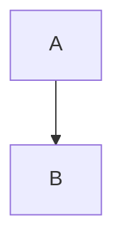

# Diagram Export Fix - Complete

## Проблема

Диаграммы Draw.io/Gliffy не экспортировались корректно:
- При копировании/скачивании markdown оставались ссылки `![[1.png]]` без самих файлов
- При экспорте в Obsidian Vault PNG файлы не скачивались
- Имена диаграмм терялись при конвертации

## Решение

### 1. Извлечение имён диаграмм (converter.ts)

**Проблема:** Имена диаграмм хранятся в `<script>` тегах, которые удаляются при санитизации.

**Решение:**
- Функция `extractDiagramNameFromScript()` парсит `readerOpts.diagramName` из скриптов
- `sanitizeHtml()` извлекает имена ДО удаления скриптов
- Имена сохраняются в `data-extracted-diagram-name` атрибутах
- Поддержка URL-encoded имён (кириллица, цифры)

### 2. Конвертация диаграмм в markdown (exporter.ts)

**Проблема:** `buildMarkdownDocument()` не вызывал `sanitizeHtml()` перед конвертацией.

**Решение:**
- Добавлен вызов `sanitizeHtml()` перед `convertToMarkdown()`
- Добавлен параметр `diagramFormat: 'mermaid' | 'drawio-xml' | 'wikilink'`:
  - `'wikilink'` → диаграммы как `![[name.png]]` (для Obsidian Vault)
  - `'mermaid'` → конвертация в mermaid блоки
  - `'drawio-xml'` → вставка исходного XML как код

### 3. Скачивание PNG для Obsidian Vault (obsidian-exporter.ts)

**Проблема:** Диаграммы искались через API attachments, но inline диаграммы там отсутствуют.

**Решение:**
- Извлечение диаграмм напрямую из HTML через `extractDiagramReferences()`
- Скачивание PNG по render URL: `/plugins/servlet/drawio/export?pageId=X&diagramName=Y&format=png`
- Сохранение в `_attachments/` с правильными именами

### 4. UI для выбора формата диаграмм (modal.ts)

**Добавлено:**
- Радио-кнопки в панели "Diagrams (Draw.io)":
  - **Wikilinks (![[name.png]])** - по умолчанию, для Obsidian Vault
  - **Mermaid code** - конвертация в Mermaid flowcharts
  - **Draw.io XML** - вставка исходного XML
- Настройка сохраняется в `obsidianSettings.diagramTargetFormat`
- Применяется для Copy и Download действий

## Результаты

### Тесты
- ✅ 29 тестов проходят, 2 пропущены
- ✅ Интеграционный тест с реальным HTML файлом
- ✅ Тесты для русских и числовых имён диаграмм
- ✅ Тесты для всех форматов экспорта

### Функциональность

**Copy to Clipboard (выбор формата):**
```markdown
# Wikilinks mode
![[diagram-name.png]]
%% Editable source: diagram-name.drawio %%

# Mermaid mode


# Draw.io XML mode
```xml
<mxfile>...</mxfile>
```
```

**Download Markdown (выбор формата):**
- Те же 3 варианта что и для Copy

**Download Obsidian Vault (ZIP):**
```
vault.zip
├── Page.md          → ![[diagram-name.png]]
└── _attachments/
    └── diagram-name.png
```

## Файлы изменены

1. `src/core/converter.ts` - извлечение имён диаграмм
2. `src/core/exporter.ts` - добавлен sanitizeHtml + diagramFormat параметр
3. `src/main.ts` - использование obsidianSettings.diagramTargetFormat
4. `src/core/obsidian-exporter.ts` - прямое скачивание PNG
5. `src/core/attachment-handler.ts` - convertDrawioToMermaid функция
6. `src/ui/modal.ts` - UI для выбора формата диаграмм
7. `src/api/types.ts` - обновлённые типы
8. `src/storage/types.ts` - настройки по умолчанию
9. `__tests__/*.test.ts` - комплексные тесты (29 тестов)

## Поддерживаемые форматы

- ✅ Draw.io (`data-macro-name="drawio"`)
- ✅ Draw.io Sketch (`data-macro-name="drawio-sketch"`)
- ✅ Gliffy (`data-macro-name="gliffy"`)
- ✅ PlantUML (конвертация в mermaid)
- ✅ Mermaid (сохранение как есть)

## Известные ограничения

- Конвертация Draw.io → Mermaid использует `@whitebite/diagram-converter`
- PDF экспорт не конвертирует диаграммы (остаются как есть)
- Для конвертации нужен доступ к .drawio файлам в attachments
